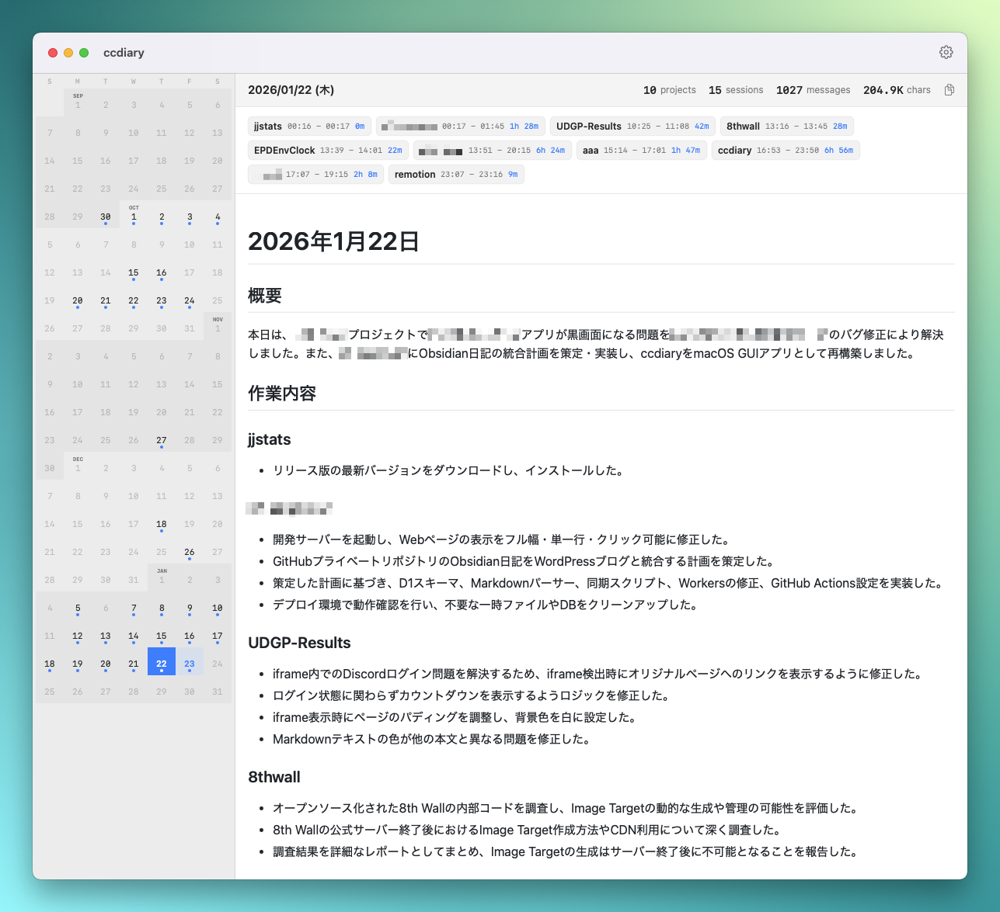

English | [日本語](README.ja.md)

# CCDiary

<p align="center">
  
  <br>
  A macOS app that automatically generates work diaries from Claude Code conversation history.
</p>



## Features

- **Automatic History Collection** - Collects Claude Code conversation history automatically
- **Calendar-Centric UI** - Dynamically shows from earliest activity to end of current month
- **Project Organization** - Organizes activities by project
- **Multi-Provider Support** - Choose between Claude CLI, Claude API, or Gemini API
- **Large File Handling** - Efficiently processes 87MB+ log files with binary search optimization
- **Markdown Output** - Saves and displays diaries in Markdown format

## Installation

1. Download the latest `.dmg` from [Releases](https://github.com/Saqoosha/CCDiary/releases)
2. Open the DMG and drag `CCDiary.app` to Applications
3. Launch the app

## Configuration

### AI Provider

1. Open CCDiary.app
2. Go to Settings (gear icon)
3. Select your preferred AI provider:
   - **Claude CLI** - No additional setup required if Claude Code is already installed
   - **Claude API** - Requires Anthropic API key
   - **Gemini API** - Requires Google AI API key
4. Enter your API key (if required)
5. Click "Save"

### Diaries Directory

By default, diaries are saved to `~/Desktop/CCDiary/diaries`. You can change this in Settings.

## Usage

### Calendar View

- Continuous scrollable calendar from earliest activity to end of current month
- Days with activity are marked with a dot
- Days with generated diaries show a checkmark
- Auto-scrolls to today on launch

### Day View

- Statistics for selected day (projects, sessions, messages, characters)
- Activity breakdown by project
- Displays generated diary
- Copy button to clipboard

### Diary Generation

1. Select a day with activity
2. Click the "Generate" button
3. Wait for the AI to generate your diary
4. The diary is automatically saved

## Data Sources

Reads the following files recorded by Claude Code:

- `~/.claude/history.jsonl` - Input history across all projects
- `~/.claude/projects/{encoded-path}/*.jsonl` - Detailed conversation logs per project

## Output

Diaries are saved in Markdown format:

```
diaries/
├── 2026-01-20.md
├── 2026-01-21.md
└── 2026-01-22.md
```

### Sample Output

```markdown
## Summary

Today I worked on 3 projects, mainly focusing on API improvements and bug fixes.

## By Project

### my-project

- Fixed authentication bug
- Added pagination to user list API
- Improved test coverage

### another-project

- Created new component
- Adjusted styling

## Today's Highlight

Resolved authentication issues and prepared for a stable release.
```

---

## Development

### Requirements

- macOS 14.0+
- Xcode 15+
- [XcodeGen](https://github.com/yonaskolb/XcodeGen)

### Build from Source

```bash
git clone https://github.com/Saqoosha/CCDiary.git
cd CCDiary

# Generate Xcode project
xcodegen generate

# Build
xcodebuild -scheme CCDiary -configuration Debug -derivedDataPath build build

# Run
open build/Build/Products/Debug/CCDiary.app
```

Or open directly in Xcode:

```bash
open Package.swift
```

### Architecture

See [docs/ARCHITECTURE.md](docs/ARCHITECTURE.md) for detailed architecture documentation.

## Third Party Licenses

This project uses the following open-source libraries:

- **[marked](https://github.com/markedjs/marked)** - A markdown parser and compiler. MIT License, Copyright (c) 2011-2025, Christopher Jeffrey.
- **[github-markdown-css](https://github.com/sindresorhus/github-markdown-css)** - GitHub Markdown styles. MIT License, Copyright (c) Sindre Sorhus.

## License

MIT
